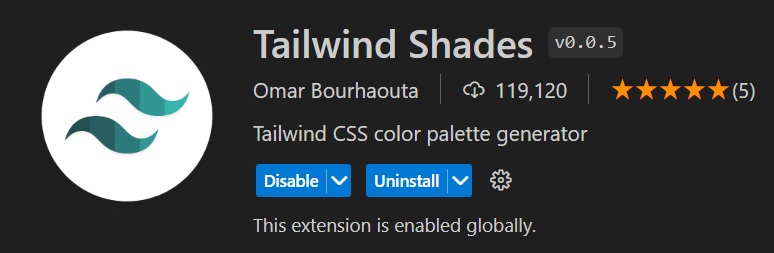
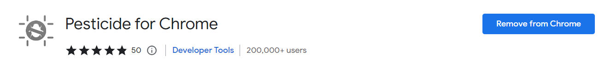

# Dashboard App

## Installations

```
npm i @mui/icons-material @mui/material @emotion/styled @emotion/react @fontsource/roboto @fullcalendar/timegrid @fullcalendar/list @fullcalendar/daygrid @mui/x-data-grid react-router-dom react-pro-sidebar @nivo/core @nivo/pie @nivo/line @nivo/bar @nivo/geo
```

## Tailwind

A plugin for vscode that gives shades of the same color


## Chrome extension


